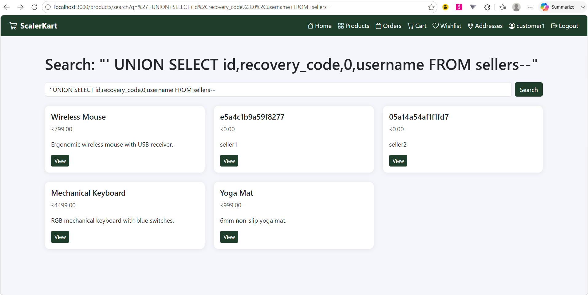
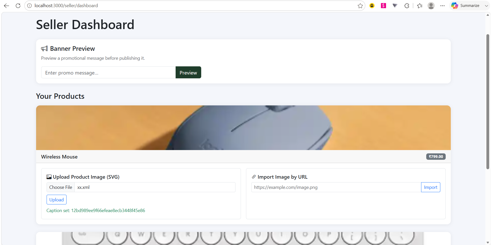
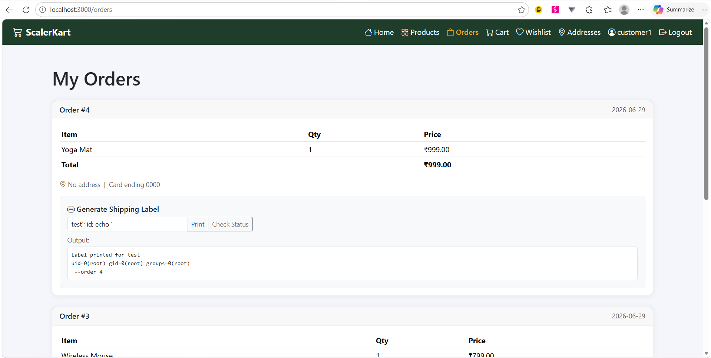
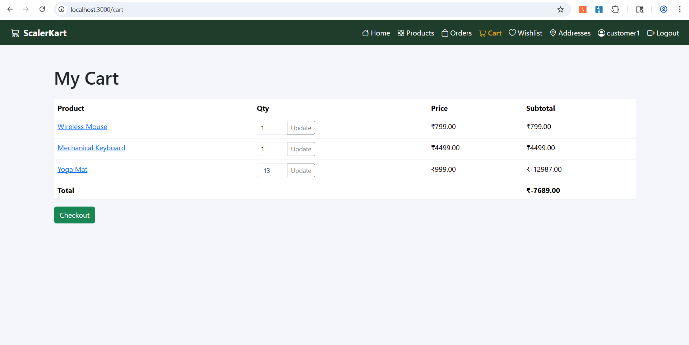

# ScalerKart CTF - Vulnerability Writeups
**Student NAME:** `Harsh Kumar Panchal`

**Student ID:** `23bcs10087`

<br>

---

<br>

## Title: UNION-Based SQL Injection in Product Search Parameter

### Description
The application is vulnerable to SQL Injection within the product search feature. User-supplied input from the search query parameter is incorporated directly into a backend SQLite query without parameterization or escaping. 

When analyzing the vulnerability, it is evident the backend dynamically evaluates the following query structure:

```sql
SELECT id, name, price, description FROM products WHERE name LIKE '%{q}%'
```

**Vulnerability Mechanics:**
The core issue is that the application trusts user input as part of the query structure. By injecting a single quote (`'`), the attacker prematurely closes the `LIKE` string literal. Because the backend expects 4 columns (`id, name, price, description`) to render the product cards, the attacker must align their injected payload to match this structure. Using the `UNION SELECT` operator allows the attacker to fuse the results of an entirely different table (e.g., `sellers`) into the original result set. The trailing `--` (SQL comment) is crucial as it instructs the database engine to ignore the remaining `%'` from the original query, preventing a syntax error.

### Steps to Exploit
1. Authenticate to the application as a standard customer (`customer1`) to access the catalog.
2. Navigate to the main Products listing page.
3. Intercept the search request using Burp Suite to bypass any client-side UI restrictions.
4. Locate the `q` (search) parameter in the HTTP GET request.
5. **Enumeration Phase:** First, determine the column count by injecting `' ORDER BY 1--`, `' ORDER BY 2--`, etc., until an error occurs. Once 4 columns are confirmed, find the string-compatible column by injecting `' UNION SELECT NULL,'test',NULL,NULL--`.
6. **Exploitation Phase:** Modify the parameter value to extract target data: `' UNION SELECT id,recovery_code,0,username FROM sellers-- `
7. Forward the modified request to the server.
8. Observe the HTTP response containing seller recovery codes (e.g., `e5a4c1b9a59f8277` for `seller1`) rendered as product titles within the HTML.

### Proof of Concept

**Payload:**
```sql
' UNION SELECT id,recovery_code,0,username FROM sellers-- 
```

**Original Query Context:**
```sql
SELECT id, name, price, description FROM products WHERE name LIKE '%{q}%'
```

**Modified Query Executed by Database:**
```sql
SELECT id, name, price, description FROM products WHERE name LIKE '%' UNION SELECT id,recovery_code,0,username FROM sellers-- %'
```



### Impact
* Unauthorized access to sensitive database records.
* Exposure of seller recovery codes, administrative credentials, or application secrets.
* Loss of data confidentiality and potential account takeover.

### Mitigation / Remediation
1. Implement parameterized queries (prepared statements) for all database operations to ensure data is never treated as executable code.
2. Remove any use of string formatting (e.g., f-strings) or concatenation when building SQL queries.
3. Restrict database connection privileges so the storefront application cannot read sensitive tables like `sellers` or `users`.
4. Validate and sanitize the search input against an strict allowlist of expected characters.

### CVSS Score
**CVSS v3.1 Score:** 6.5 (Medium)  
**Vector:** CVSS:3.1/AV:N/AC:L/PR:L/UI:N/S:U/C:H/I:N/A:N

### CVSS Justification
* **Attack Vector:** Network (Exploitable remotely over the internet)
* **Attack Complexity:** Low (No race conditions or specialized configurations required)
* **Privileges Required:** Low (Requires standard customer authentication)
* **User Interaction:** None (No victim action required)
* **Scope:** Unchanged (Impact is contained within the vulnerable application itself)
* **Confidentiality Impact:** High (Complete disclosure of sensitive database tables)
* **Integrity Impact:** None (The UNION SELECT vector does not modify database records)
* **Availability Impact:** None (No service disruption observed)

<br>

---

<br>

## Title: XML External Entity (XXE) Injection in Supplier SVG Upload

### Description
The application is vulnerable to XML External Entity (XXE) Injection in the seller product image upload functionality. The backend utilizes an XML parser (`lxml`) with entity resolution enabled (`resolve_entities=True`) when processing uploaded SVG (Scalable Vector Graphics) files. 

**Vulnerability Mechanics:**
Because SVG is fundamentally an XML-based format, it supports standard XML features, including Document Type Definitions (DTDs). The vulnerability occurs *before* the application logic even processes the image metadata. When the XML parser encounters the `<!ENTITY xxe SYSTEM "file:///app/data/canary_xxe.txt">` directive, the `SYSTEM` keyword instructs the parser to fetch the resource located at that URI. 

Because `resolve_entities=True` is misconfigured on the backend, the parser reads the local host file and directly substitutes its bytes into the XML tree wherever the `&xxe;` reference is found. When the application subsequently extracts the `<title>` tag to render the image caption, it unknowingly reflects the contents of the sensitive system file back to the client.

### Steps to Exploit
1. Authenticate to the application as a seller (`seller1`).
2. Navigate to the Seller Dashboard and initiate a new product creation.
3. Intercept the product creation `multipart/form-data` request using Burp Suite.
4. Replace the image file content with a malicious XML/SVG payload targeting `/app/data/canary_xxe.txt` (as seen in the screenshot using the filename `xx.xml`).
5. Forward the modified request to the server.
6. Navigate back to the Seller Dashboard.
7. Observe the contents of the target server file (e.g., the hash `12bd989ee9f66efeae8ecb3448f45e86`) seamlessly reflected in the green "Caption set" success message.

### Proof of Concept

**Payload (xx.xml):**
```xml
<?xml version="1.0"?>
<!DOCTYPE svg [
  <!ENTITY xxe SYSTEM "file:///app/data/canary_xxe.txt">
]>
<svg xmlns="http://www.w3.org/2000/svg">
  <title>&xxe;</title>
</svg>
```

**Original Parsing Context:**
```python
# Unsafe XML parsing configuration
parser = etree.XMLParser(resolve_entities=True)
root = etree.fromstring(uploaded_svg_bytes, parser)
```

**Modified Execution Logic:**
The parser performs a local file read on the host system and splices the file bytes into the `<title>` node prior to application handling.



### Impact
* Unauthorized local file read access on the application server.
* Exposure of sensitive configuration files, source code, environment variables, and internal tokens.
* Potential pivot point for Server-Side Request Forgery (SSRF) if the entity targets internal network resources.

### Mitigation / Remediation
1. Disable external entity resolution in the XML parser by configuring `resolve_entities=False` and `load_dtd=False`.
2. Avoid parsing untrusted XML/SVG files where possible; use image processing libraries that only render raster data.
3. Implement strict validation on uploaded files, enforcing expected MIME types and file signatures rather than relying on extensions.
4. Run the application container with least privilege to restrict filesystem access.

### CVSS Score
**CVSS v3.1 Score:** 7.1 (High)  
**Vector:** CVSS:3.1/AV:N/AC:L/PR:L/UI:N/S:U/C:H/I:N/A:L

### CVSS Justification
* **Attack Vector:** Network (Exploitable via HTTP upload)
* **Attack Complexity:** Low (Payload delivery is straightforward)
* **Privileges Required:** Low (Requires standard seller authentication)
* **User Interaction:** None (No victim action required)
* **Scope:** Unchanged (Exploits the application container)
* **Confidentiality Impact:** High (Exposes sensitive system files and secrets)
* **Integrity Impact:** None (Does not overwrite files)
* **Availability Impact:** Low (Processing large entities can cause localized resource consumption)

<br>

---

<br>

## Title: OS Command Injection in Shipping Label Generator

### Description
The application is vulnerable to OS Command Injection in the shipping label generation feature. User-supplied input, specifically the shipping recipient name, is passed directly into a shell command execution function without sanitization or escaping.

**Vulnerability Mechanics:**
The application executes a backend shell call structured similarly to:
```python
subprocess.run(f"label-printer {recipient_name} --order {order_id}", shell=True)
```
The critical flaw is the use of `shell=True`. This tells the Python interpreter to pass the entire formatted string to the system shell (e.g., `/bin/sh -c`). The shell inherently interprets special metacharacters like semicolons (`;`), pipes (`|`), or ampersands (`&&`) as command separators. 

By supplying a payload like `test'; id; echo '`, the attacker breaks the recipient name string early. The shell processes this as three entirely distinct commands:
1. `label-printer test'`
2. `id` (The injected malicious command)
3. `echo ' --order 12345` (A cleanup command to safely consume the leftover string suffix).

### Steps to Exploit
1. Authenticate to the application as a customer.
2. Add a product to the cart and proceed to the checkout process.
3. Intercept the checkout submission request using Burp Suite to manipulate background API parameters.
4. Locate the `recipient_name` parameter in the POST body.
5. Modify the value to break the command context and inject a new command: `test'; id; echo '`
6. Forward the request to generate the label.
7. Click "Check Status" on the Orders page.
8. Observe the output of the `id` command returned within the application's response payload.

### Proof of Concept

**Payload:**
```bash
test'; id; echo '
```

**Original Execution Context:**
```python
subprocess.run(f"label-printer {recipient_name} --order {order_id}", shell=True)
```

**Modified Command Executed by System:**
```bash
label-printer test'; id; echo ' --order 12345
```

**Observed Output in UI:**
```text
Label printed for test
uid=0(root) gid=0(root) groups=0(root)
 --order 4
```



### Impact
* Complete compromise of the application container or host system.
* Arbitrary code execution allowing data exfiltration, system manipulation, or malware installation.
* Loss of confidentiality, integrity, and availability.

### Mitigation / Remediation
1. Never use `shell=True` when executing subprocesses with untrusted input.
2. Use safe array-based execution arguments where the system treats the input purely as data, not as a command string (e.g., `subprocess.run(["label-printer", recipient_name, "--order", str(order_id)])`).
3. Implement strict input validation and sanitization for names, using an allowlist of expected alphanumeric characters.
4. Execute the application with a highly restricted service account to minimize the impact of command execution.

### CVSS Score
**CVSS v3.1 Score:** 8.8 (High)  
**Vector:** CVSS:3.1/AV:N/AC:L/PR:L/UI:N/S:U/C:H/I:H/A:H

### CVSS Justification
* **Attack Vector:** Network (Exploitable over HTTP)
* **Attack Complexity:** Low (Direct injection into a known parameter)
* **Privileges Required:** Low (Requires customer authentication to checkout)
* **User Interaction:** None (No victim interaction required)
* **Scope:** Unchanged (Impacts the hosting container/application)
* **Confidentiality Impact:** High (Attacker can read any file readable by the application user)
* **Integrity Impact:** High (Attacker can modify any file writable by the application user)
* **Availability Impact:** High (Attacker can terminate processes or delete application files)

<br>

---

<br>

## Title: Negative Quantity Business Logic Flaw in Checkout

### Description
The application suffers from a critical business logic flaw within its shopping cart checkout process. The cart update endpoint accepts numerical quantity values but fails to enforce positive bounds checking server-side.

**Vulnerability Mechanics:**
This vulnerability highlights the dangers of "Client-Side Trust." The developers assumed that because the web interface UI only allows users to select positive quantities (e.g., via a dropdown or HTML5 `min="1"` attribute), the server would only ever receive positive integers. 

However, when calculating the total order cost, the backend naively multiplies the item price by the submitted quantity:
```python
order_total += product.price * item.quantity
```
By intercepting the HTTP request before it reaches the server, an attacker bypasses all UI restrictions. Supplying a negative integer (e.g., `-1`) for the `quantity` parameter causes the server's mathematical operation to invert. Instead of adding to the total cost, the backend effectively subtracts the item's value, allowing the attacker to drive the final checkout total to `$0.00` or below.

### Steps to Exploit
1. Authenticate to the application as a customer.
2. Add one or more products to the shopping cart.
3. Intercept the cart update API request using Burp Suite to bypass HTML/JS frontend protections.
4. Locate the JSON payload containing the product ID and quantity.
5. Modify the `quantity` parameter for an item (e.g., the Yoga Mat) to a large negative value (e.g., `-13`).
6. Forward the request to update the cart state on the server.
7. Proceed through the checkout flow.
8. Observe that the subtotal for that item becomes negative (e.g., `₹-12987.00`), causing the final cart total to calculate to a negative value (e.g., `₹-7689.00`).

### Proof of Concept

**Payload:**
```json
{
  "product_id": 3,
  "quantity": -13
}
```

**Original Calculation Context:**
```python
# Assuming price is ₹999.00 and expected quantity is 1
order_total = 999.00 * 1  # Total = ₹999.00
```

**Modified Calculation Executed by Backend:**
```python
# Assuming price is ₹999.00 and injected quantity is -13
order_total = 999.00 * -13 # Total = ₹-12987.00
```



### Impact
* Direct financial loss to the business via free product acquisition.
* Disruption of inventory and accounting systems.
* Abuse of fulfillment and shipping resources without actual payment.

### Mitigation / Remediation
1. Implement strict server-side validation on all numerical inputs, specifically enforcing `quantity > 0` for cart items.
2. Validate data types and boundaries at the API schema level (e.g., setting a `minimum: 1` and `maximum: 99` rule for quantity).
3. Perform a final sanity check during the checkout finalization stage to reject any orders where the total sum is less than or equal to zero.
4. Do not trust client-side validation; ensure all mathematical constraints are enforced exclusively on the server.

### CVSS Score
**CVSS v3.1 Score:** 6.5 (Medium)  
**Vector:** CVSS:3.1/AV:N/AC:L/PR:L/UI:N/S:U/C:N/I:H/A:N

### CVSS Justification
* **Attack Vector:** Network (Exploitable over the internet via the web app)
* **Attack Complexity:** Low (Simply changing a number in the JSON request)
* **Privileges Required:** Low (Requires customer authentication)
* **User Interaction:** None (No victim action required)
* **Scope:** Unchanged (Impacts the business logic of the app itself)
* **Confidentiality Impact:** None (No data is exposed or leaked)
* **Integrity Impact:** High (Circumvents financial constraints and corrupts order integrity)
* **Availability Impact:** None (The application remains fully operational)
